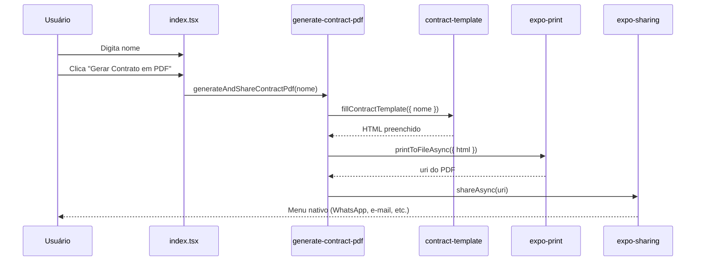
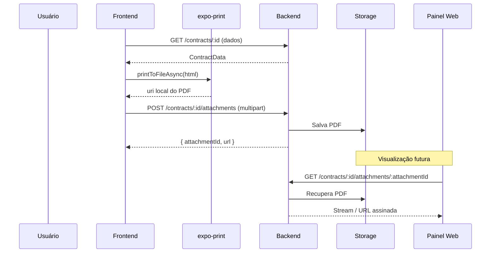

# Arquitetura de Geração de Contratos em PDF

> Documento de referência para evoluir o app **contract** (Expo SDK 54) a partir do exemplo atual — digitação manual de `nome` — até um fluxo completo integrado com backend, geração de PDF no frontend e reanexação ao sistema para visualização.

---

## 1. Visão geral

O projeto demonstra um padrão simples e extensível:

```
Backend (fonte de dados)
    ↓
Frontend (monta o contrato)
    ↓
Template HTML (placeholders {{campo}})
    ↓
expo-print (HTML → PDF)
    ↓
expo-sharing (compartilhar / salvar)
    ↓
Backend (upload do PDF anexado)
    ↓
Sistema (visualização do contrato assinado)
```

Hoje o fluxo termina no compartilhamento. A estrutura já separa responsabilidades de forma que a integração com API seja incremental, sem reescrever a lógica de PDF.

---

## 2. Estrutura atual do projeto

```
src/
├── app/
│   ├── _layout.tsx          # Navegação (Tabs)
│   └── index.tsx            # Tela: formulário + botão "Gerar Contrato em PDF"
├── utils/
│   ├── contract-template.ts # Template HTML + preenchimento de placeholders
│   └── generate-contract-pdf.ts # Orquestração: template → PDF → share
├── components/              # UI reutilizável (ThemedText, ThemedView, etc.)
├── hooks/                   # Lógica de tema
└── constants/               # Tokens visuais
```

### Responsabilidade de cada camada

| Camada | Arquivo | Responsabilidade (SRP) |
|--------|---------|------------------------|
| **UI** | `app/index.tsx` | Capturar input do usuário, estados de loading/erro, disparar ação |
| **Template** | `utils/contract-template.ts` | Definir layout HTML e substituir `{{placeholders}}` |
| **Serviço PDF** | `utils/generate-contract-pdf.ts` | Gerar arquivo PDF e abrir compartilhamento |
| **Constantes** | `constants/theme.ts` | Estilos visuais da interface (não do PDF) |

> **Clean Code:** a tela não conhece HTML nem detalhes do `expo-print`. Ela só chama uma função com os dados necessários.

---

## 3. Fluxo atual (manual)



### Exemplo do template

O placeholder `{{nome}}` é substituído em tempo de execução:

```html
<div class="field">
  <span class="label">Nome:</span> {{nome}}
</div>
```

```typescript
// contract-template.ts
export function fillContractTemplate(data: { nome: string }): string {
  const nome = escapeHtml(data.nome.trim());
  return CONTRACT_TEMPLATE.replace(/\{\{nome\}\}/g, nome);
}
```

---

## 4. Evolução: dados vindos do backend

Quando `nome`, `cpf`, `valor` e demais campos vêm de uma API, o frontend **não deve** montar o contrato na tela. Ele deve **buscar**, **validar** e **repassar** os dados para a camada de template.

### 4.1 Modelo de dados tipado

```typescript
// src/types/contract.ts

export interface ContractData {
  id: string;
  nome: string;
  cpf?: string;
  valor?: string;
  dataInicio?: string;
  dataFim?: string;
}

export interface ContractResponse {
  data: ContractData;
}
```

> **Clean Code:** tipos explícitos evitam strings soltas espalhadas pelo código e documentam o contrato entre frontend e backend.

### 4.2 Camada de API (Single Responsibility)

```typescript
// src/services/contract-api.ts

import type { ContractData } from '@/types/contract';

const API_BASE = process.env.EXPO_PUBLIC_API_URL ?? '';

export async function fetchContractById(id: string): Promise<ContractData> {
  const response = await fetch(`${API_BASE}/contracts/${id}`);

  if (!response.ok) {
    throw new Error('Não foi possível carregar os dados do contrato.');
  }

  const json = await response.json();
  return json.data;
}
```

### 4.3 Tela consumindo o backend

```typescript
// Exemplo conceitual — app/index.tsx ou app/contrato/[id].tsx

import { useEffect, useState } from 'react';
import { fetchContractById } from '@/services/contract-api';
import { generateAndShareContractPdf } from '@/utils/generate-contract-pdf';
import type { ContractData } from '@/types/contract';

export default function ContractScreen({ contractId }: { contractId: string }) {
  const [contract, setContract] = useState<ContractData | null>(null);
  const [loading, setLoading] = useState(true);

  useEffect(() => {
    fetchContractById(contractId)
      .then(setContract)
      .catch(console.error)
      .finally(() => setLoading(false));
  }, [contractId]);

  async function handleGeneratePdf() {
    if (!contract) return;
    await generateAndShareContractPdf(contract);
  }

  // Renderiza dados preenchidos automaticamente + botão de gerar PDF
}
```

### 4.4 Generalizar o template

```typescript
// src/utils/contract-template.ts

export interface ContractTemplateData {
  nome: string;
  cpf?: string;
  valor?: string;
}

export function fillContractTemplate(data: ContractTemplateData): string {
  const safe = {
    nome: escapeHtml(data.nome.trim()),
    cpf: escapeHtml(data.cpf?.trim() ?? '—'),
    valor: escapeHtml(data.valor?.trim() ?? '—'),
  };

  return CONTRACT_TEMPLATE
    .replace(/\{\{nome\}\}/g, safe.nome)
    .replace(/\{\{cpf\}\}/g, safe.cpf)
    .replace(/\{\{valor\}\}/g, safe.valor);
}
```

> **Clean Code:** `escapeHtml` centralizado protege contra injeção de HTML quando dados vêm de fontes externas (backend, usuário).

---

## 5. Evolução: reanexar PDF ao sistema

Após gerar o PDF, o fluxo futuro envia o arquivo de volta ao backend para armazenamento e visualização posterior.



### 5.1 Serviço de upload (separado da geração)

```typescript
// src/services/contract-upload.ts

import type { ContractData } from '@/types/contract';

export async function uploadContractPdf(
  contractId: string,
  pdfUri: string,
): Promise<{ attachmentId: string; url: string }> {
  const formData = new FormData();

  formData.append('file', {
    uri: pdfUri,
    name: `contrato-${contractId}.pdf`,
    type: 'application/pdf',
  } as unknown as Blob);

  const response = await fetch(
    `${process.env.EXPO_PUBLIC_API_URL}/contracts/${contractId}/attachments`,
    {
      method: 'POST',
      body: formData,
      headers: { Accept: 'application/json' },
    },
  );

  if (!response.ok) {
    throw new Error('Falha ao enviar o contrato para o sistema.');
  }

  return response.json();
}
```

### 5.2 Orquestrador unificado

```typescript
// src/utils/generate-contract-pdf.ts (evolução)

import * as Print from 'expo-print';
import type { ContractTemplateData } from '@/utils/contract-template';
import { fillContractTemplate } from '@/utils/contract-template';
import { uploadContractPdf } from '@/services/contract-upload';

interface GenerateOptions {
  contractId: string;
  data: ContractTemplateData;
  shareAfterGenerate?: boolean;
  uploadToBackend?: boolean;
}

export async function generateContractPdf(options: GenerateOptions): Promise<string> {
  const html = fillContractTemplate(options.data);
  const { uri } = await Print.printToFileAsync({ html });

  if (options.uploadToBackend) {
    await uploadContractPdf(options.contractId, uri);
  }

  return uri;
}
```

> **Clean Code:** funções pequenas, nomes que revelam intenção (`uploadContractPdf`, `fillContractTemplate`), parâmetros agrupados em objetos quando crescem.

---

## 6. Visualização do contrato anexado

No frontend (Expo ou web), a visualização do PDF já salvo pode usar:

| Abordagem | Quando usar |
|-----------|-------------|
| **Linking.openURL(url)** | URL pública ou assinada do backend |
| **expo-web-browser** | Abrir PDF em browser in-app |
| **WebView** | Embed controlado dentro do app |
| **Download + share** | Reenviar PDF existente via `expo-sharing` |

```typescript
// src/services/contract-viewer.ts

import * as WebBrowser from 'expo-web-browser';

export async function openContractPdf(url: string): Promise<void> {
  await WebBrowser.openBrowserAsync(url);
}
```

O backend deve expor endpoints REST previsíveis:

```
GET  /contracts/:id              → dados do contrato
GET  /contracts/:id/attachments    → lista de PDFs anexados
GET  /contracts/:id/attachments/:attachmentId/download → URL ou stream do PDF
POST /contracts/:id/attachments    → upload do PDF gerado
```

---

## 7. Princípios de Clean Code aplicados

### 7.1 Single Responsibility (SRP)

Cada módulo tem **uma razão para mudar**:

- `contract-template.ts` muda quando o **layout do contrato** muda
- `generate-contract-pdf.ts` muda quando a **estratégia de PDF/share** muda
- `contract-api.ts` muda quando a **API** muda
- `index.tsx` muda quando a **experiência do usuário** muda

### 7.2 Nomes expressivos

```typescript
// ❌ Evitar
function go(d: any) { ... }

// ✅ Preferir
async function generateAndShareContractPdf(data: ContractTemplateData): Promise<void> { ... }
```

### 7.3 Funções pequenas

Uma função deve fazer **uma coisa** e fazê-la bem. Se `handleGeneratePdf` crescer demais, extrair:

```typescript
async function handleGeneratePdf() {
  const validated = validateContractForm(formData);
  const uri = await generateContractPdf({ contractId, data: validated });
  await uploadContractPdf(contractId, uri);
  await sharePdf(uri);
}
```

### 7.4 DRY sem over-engineering

Placeholders `{{campo}}` no HTML evitam duplicar layout. Não crie abstrações genéricas de template engine antes de precisar — `replace` com tipos explícitos é suficiente para a maioria dos contratos.

### 7.5 Tratamento de erros explícito

```typescript
try {
  await generateAndShareContractPdf(data);
} catch (error) {
  const message = error instanceof Error
    ? error.message
    : 'Não foi possível gerar o contrato.';
  Alert.alert('Erro', message);
}
```

Erros de rede, validação e PDF devem ter mensagens distintas quando possível.

### 7.6 Dependências apontando para dentro

```
app/ → services/ → utils/ → types/
app/ → components/
app/ → hooks/
```

Camadas internas **nunca** importam de `app/`. Utils não conhecem React.

---

## 8. Estrutura de pastas recomendada (evolução)

```
src/
├── app/
│   ├── index.tsx
│   └── contrato/
│       └── [id].tsx           # Rota dinâmica: /contrato/123
├── components/
│   └── contract/
│       ├── contract-form.tsx
│       └── contract-preview.tsx
├── hooks/
│   └── use-contract.ts        # Encapsula fetch + estados
├── services/
│   ├── contract-api.ts        # GET contrato
│   └── contract-upload.ts     # POST anexo PDF
├── types/
│   └── contract.ts            # Interfaces compartilhadas
└── utils/
    ├── contract-template.ts   # HTML + placeholders
    └── generate-contract-pdf.ts
```

---

## 9. Checklist de implementação futura

- [ ] Criar `types/contract.ts` com interface alinhada ao backend
- [ ] Criar `services/contract-api.ts` para buscar dados automaticamente
- [ ] Generalizar `fillContractTemplate` para múltiplos campos
- [ ] Refatorar `generate-contract-pdf.ts` para aceitar objeto `ContractData`
- [ ] Implementar `uploadContractPdf` com `FormData`
- [ ] Adicionar tela de listagem/visualização de anexos
- [ ] Configurar `EXPO_PUBLIC_API_URL` no `.env`
- [ ] Tratar estados: loading, empty, error, success
- [ ] Testes unitários em `fillContractTemplate` e `escapeHtml`

---

## 10. Prompt para IA / novos desenvolvedores

Use o texto abaixo como ponto de partida ao pedir implementações neste projeto:

---

**Prompt:**

> Este projeto Expo (SDK 54) gera contratos em PDF a partir de um template HTML com placeholders (`{{nome}}`, etc.).
>
> A arquitetura segue Clean Code:
> - **UI** em `src/app/` — apenas apresentação e interação
> - **Services** em `src/services/` — comunicação com backend (fetch, upload)
> - **Utils** em `src/utils/` — template HTML e geração PDF via `expo-print` + `expo-sharing`
> - **Types** em `src/types/` — contratos de dados tipados
>
> Fluxo desejado:
> 1. Backend retorna dados do contrato (`GET /contracts/:id`)
> 2. Frontend preenche o template automaticamente (sem digitação manual)
> 3. Usuário gera PDF localmente com `printToFileAsync`
> 4. PDF é enviado de volta ao backend (`POST /contracts/:id/attachments`)
> 5. Sistema permite visualizar o PDF anexado posteriormente
>
> Regras:
> - Uma responsabilidade por arquivo
> - Funções pequenas com nomes descritivos
> - Escapar HTML de dados externos
> - Não misturar lógica de API dentro de componentes React
> - Manter compatibilidade com Expo Go (SDK 54)
>
> Implemente [descreva a feature] mantendo essa estrutura.

---

## 11. Referências do projeto

| Recurso | Caminho |
|---------|---------|
| Tela principal | `src/app/index.tsx` |
| Template HTML | `src/utils/contract-template.ts` |
| Geração PDF | `src/utils/generate-contract-pdf.ts` |
| Config Expo | `app.json` |
| Dependências | `package.json` |

Documentação oficial:
- [expo-print](https://docs.expo.dev/versions/v54.0.0/sdk/print/)
- [expo-sharing](https://docs.expo.dev/versions/v54.0.0/sdk/sharing/)
- [Expo Router](https://docs.expo.dev/router/introduction/)
