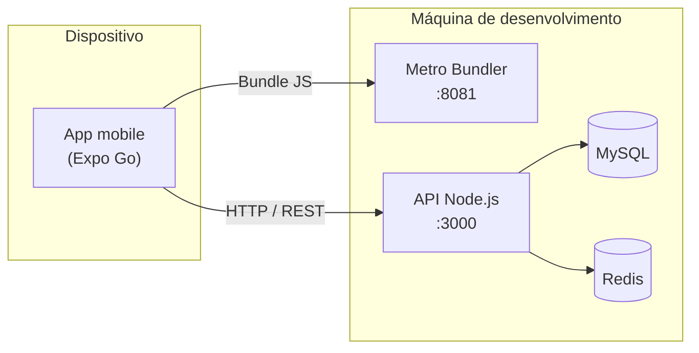

# Toca Aqui

Plataforma que conecta artistas, estabelecimentos e público a shows e eventos musicais. Este repositório reúne a **API REST** e o **aplicativo mobile** em um único monorepo, organizado em pastas independentes.

---

## Visão geral da arquitetura



| Componente | Pasta | Tecnologia | Porta padrão |
|------------|-------|------------|--------------|
| Backend (API) | `backend-TocaAqui/` | Node.js, Express, Sequelize | `3000` |
| Frontend (app) | `TocaAqui/` | Expo SDK 54, React Native | `8081` (Metro) |
| Banco de dados | Docker | MySQL 8 | `3307` (host) |
| Cache / filas | Docker | Redis 7 | `6379` |

---

## Estrutura do repositório

```
Toca-Aqui/
├── backend-TocaAqui/     # API, migrações, testes e Docker
├── TocaAqui/              # Aplicativo mobile (Expo)
├── docs/                  # Documentação do projeto
└── README.md              # Este arquivo
```

---

## Pré-requisitos

Antes de iniciar, instale e configure:

| Ferramenta | Finalidade |
|------------|------------|
| [Node.js](https://nodejs.org/) (LTS) | Execução do backend e do frontend |
| [Docker Desktop](https://www.docker.com/products/docker-desktop/) | Ambiente recomendado para API, MySQL e Redis |
| [Expo Go](https://expo.dev/go) | Execução do app em dispositivo físico durante o desenvolvimento |
| Git | Controle de versão do código-fonte |

> **Observação:** para testes no celular, o computador e o dispositivo devem estar na **mesma rede Wi‑Fi**, com perfil de rede **Privado** no Windows e firewall liberando as portas `3000` e `8081`.

---

## Guia de execução

Siga a ordem abaixo: o aplicativo depende da API em execução.

### Etapa 1 — Backend

Abra um terminal na **raiz do repositório** e entre na pasta da API:

```bash
cd backend-TocaAqui
```

#### Opção recomendada: Docker

Com o Docker Desktop em execução:

```bash
docker compose up -d
```

| Verificação | URL |
|-------------|-----|
| Saúde da API | [http://localhost:3000/health](http://localhost:3000/health) |
| Raiz da API | [http://localhost:3000/](http://localhost:3000/) |

Para encerrar os serviços:

```bash
docker compose down
```

#### Opção alternativa: Node.js local

Utilize esta opção apenas se já possuir MySQL e Redis configurados localmente.

```bash
npm install
npm run dev
```

---

### Etapa 2 — Frontend (aplicativo mobile)

Mantenha o backend em execução. Em um **novo terminal**, na raiz do repositório:

```bash
cd TocaAqui
npm install
```

#### Configuração de ambiente (opcional)

Em desenvolvimento, o aplicativo tenta detectar automaticamente o endereço da API via Expo Go. Caso o dispositivo não alcance o servidor, crie o arquivo de ambiente local:

```bash
cp .env.example .env.development.local
```

Edite `.env.development.local` e informe o IPv4 da sua máquina na rede Wi‑Fi (consulte com `ipconfig` no Windows):

```env
EXPO_PUBLIC_API_URL=http://192.168.0.10:3000
```

> O arquivo `.env.development.local` não é versionado no Git. Cada desenvolvedor deve configurá-lo na própria máquina.

#### Inicialização do Expo

```bash
npm run start:clear
```

| Ação | Descrição |
|------|-----------|
| Escanear o QR code | Abra o **Expo Go** no celular e leia o código exibido no terminal |
| Confirmar o endereço do Metro | Deve aparecer `exp://SEU_IP:8081` (não `127.0.0.1` no celular físico) |
| Confirmar a API no log | Ao usar o app: `[API] baseURL → http://SEU_IP:3000` |

Scripts úteis na pasta `TocaAqui/`:

| Comando | Função |
|---------|--------|
| `npm start` | Inicia o Expo em modo LAN |
| `npm run start:clear` | Limpa o cache e inicia em modo LAN |
| `npm run start:tunnel` | Utiliza túnel (quando a rede local bloquear conexões) |

Documentação complementar do app: [TocaAqui/README.md](TocaAqui/README.md).

---

## Validação do ambiente

Utilize este roteiro para confirmar que tudo está operacional antes de desenvolver ou demonstrar o sistema.

| # | Responsável | Verificação | Resultado esperado |
|---|-------------|-------------|-------------------|
| 1 | PC | `http://localhost:3000/health` | JSON com status `healthy` |
| 2 | Celular (navegador) | `http://SEU_IP:3000/health` | Mesmo JSON da etapa anterior |
| 3 | Terminal Expo | URL do Metro | `exp://SEU_IP:8081` |
| 4 | App (log) | Registro ou login | Sem `ERR_NETWORK`; respostas HTTP da API |

---

## Solução de problemas frequentes

| Sintoma | Causa provável | Ação sugerida |
|---------|----------------|---------------|
| `Failed to download remote update` no Expo Go | Metro inacessível (`127.0.0.1` ou firewall) | Use `npm run start:clear`; confira Wi‑Fi privado e porta `8081` |
| `ERR_NETWORK` no cadastro/login | API inacessível na porta `3000` | Teste `/health` no navegador do celular; libere porta `3000` |
| Expo exibe `127.0.0.1:8081` | IP da LAN não detectado | Defina `EXPO_PUBLIC_API_URL` em `.env.development.local` |
| Porta `8081` em uso | Instância anterior do Metro ativa | Encerre o processo ou responda `yes` para usar outra porta |

---

## Branch de desenvolvimento

O fluxo estável de integração do app e da API encontra-se na branch **`Dev`**. Após clonar ou atualizar o repositório:

```bash
git checkout Dev
git pull origin Dev
```

Em seguida, execute as etapas 1 e 2 deste documento.

---

## Licença e documentação adicional

Documentação arquitetural, ADRs e materiais de apoio estão disponíveis na pasta [`docs/`](docs/).

Para dúvidas específicas do mobile (entrypoint, navegação, variáveis de ambiente), consulte [`TocaAqui/README.md`](TocaAqui/README.md).
