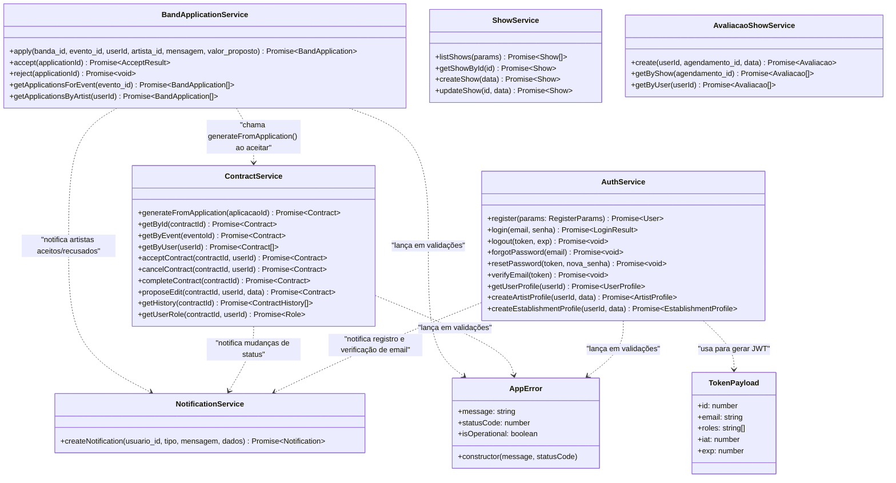
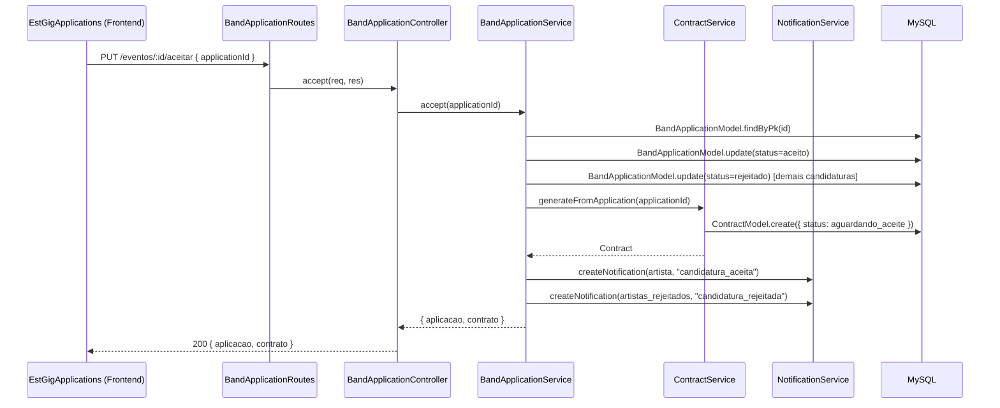

# Diagrama de Classes — Camada de Serviço

> Representa os principais serviços do domínio e suas dependências.
> Arquitetura: Monolito modular com separação Routes → Controllers → Services → Models.

## Diagrama



## Fluxo de Chamadas — Aceitar Candidatura



## Arquitetura de Camadas

```
┌─────────────────────────────────────────┐
│           Frontend (React Native)        │
└──────────────────┬──────────────────────┘
                   │ HTTP / REST
┌──────────────────▼──────────────────────┐
│           Routes (Express Router)        │
│  auth middleware → validate middleware   │
└──────────────────┬──────────────────────┘
                   │
┌──────────────────▼──────────────────────┐
│           Controllers                    │
│  Parse req → call service → format res  │
└──────────────────┬──────────────────────┘
                   │
┌──────────────────▼──────────────────────┐
│           Services (Domínio)             │
│  BandApplicationService, ContractService │
│  AuthService, NotificationService, ...   │
└──────────────────┬──────────────────────┘
                   │
┌──────────────────▼──────────────────────┐
│           Models (Sequelize ORM)         │
│  20 models mapeados para MySQL           │
└──────────────────┬──────────────────────┘
                   │
┌──────────────────▼──────────────────────┐
│  MySQL 8.0  │  Redis 7 (cache + sessions)│
└─────────────────────────────────────────┘
```
