# DER — Diagrama Entidade-Relacionamento

> Schema validado contra os models Sequelize em `src/models/` e migrations em `migrations/`.
> Banco de dados: MySQL 8.0.

## Diagrama

```mermaid
erDiagram
    USUARIOS {
        int id PK
        string nome_completo
        string email UK
        string senha
        enum role "common_user | artist | establishment_owner | admin"
        json roles "array de roles"
        boolean email_verificado
        string foto_perfil
        datetime created_at
        datetime updated_at
    }

    PERFIS_ARTISTAS {
        int id PK
        int usuario_id FK
        string nome_artistico
        text biografia
        json generos
        json instrumentos
        int anos_experiencia
        string url_portfolio
        string foto_perfil
        boolean esta_disponivel
        string tipo_atuacao
        decimal cache_minimo
        decimal cache_maximo
        boolean tem_estrutura_som
        json estrutura_som
        string cidade
        string estado
        json links_sociais
        json press_kit
        json datas_indisponiveis
        int shows_realizados
        decimal nota_media
        datetime created_at
        datetime updated_at
    }

    PERFIS_ESTABELECIMENTOS {
        int id PK
        int usuario_id FK
        int endereco_id FK
        string nome_estabelecimento
        enum tipo_estabelecimento "bar | casa_show | restaurante | club | outro"
        text descricao
        string generos_musicais
        string horario_abertura
        string horario_fechamento
        string telefone_contato
        string cnpj
        string fotos
        decimal latitude
        decimal longitude
        boolean esta_ativo
        int shows_realizados
        decimal nota_media
        datetime created_at
        datetime updated_at
    }

    ENDERECOS {
        int id PK
        string rua
        string numero
        string bairro
        string cidade
        string estado
        string cep
    }

    BANDAS {
        int id PK
        string nome_banda
        text descricao
        string imagem
        json generos_musicais
        date data_criacao
        boolean esta_ativo
        decimal cache_minimo
        decimal cache_maximo
        string cidade
        string estado
        string telefone_contato
        json links_sociais
        json press_kit
        boolean tem_estrutura_som
        json estrutura_som
        decimal nota_media
        int shows_realizados
        boolean esta_disponivel
        json datas_indisponiveis
        datetime created_at
        datetime updated_at
    }

    MEMBROS_BANDA {
        int id PK
        int banda_id FK
        int perfil_artista_id FK
        string funcao
        boolean e_lider
        enum status "pending | approved | rejected"
        datetime data_entrada
        datetime created_at
        datetime updated_at
    }

    AGENDAMENTOS {
        int id PK
        int perfil_estabelecimento_id FK
        string titulo_evento
        text descricao_evento
        date data_show
        string horario_inicio
        string horario_fim
        enum status "pendente | aceito | rejeitado | cancelado | realizado"
        decimal cache_minimo
        decimal cache_maximo
        decimal preco_ingresso_inteira
        decimal preco_ingresso_meia
        int capacidade_maxima
        int ingressos_vendidos
        string classificacao_etaria
        string imagem_capa
        enum modo_venda_ingresso "antecipada | na_porta"
        boolean esta_publico
        string genero_musical
        datetime created_at
        datetime updated_at
    }

    APLICACOES_BANDA_EVENTO {
        int id PK
        int evento_id FK
        int artista_id FK
        int banda_id FK
        decimal valor_proposto
        text mensagem
        enum status "pendente | aceito | rejeitado | cancelado"
        datetime data_aplicacao
    }

    CONTRATOS {
        int id PK
        int aplicacao_id FK "UK"
        int evento_id FK
        int artista_id FK
        int banda_id FK
        int perfil_estabelecimento_id FK
        enum status "rascunho | aguardando_aceite | aceito | cancelado | concluido"
        string nome_contratante
        string documento_contratante
        string endereco_contratante
        string telefone_contratante
        string nome_contratado
        string documento_contratado
        string telefone_contratado
        date data_evento
        string horario_inicio
        string horario_fim
        int duracao_minutos
        string intervalos
        string genero_musical
        string local_evento
        decimal cache_total
        enum metodo_pagamento "pix | transferencia | cartao | dinheiro | stripe"
        decimal percentual_sinal
        decimal valor_sinal
        date data_pagamento_sinal
        date data_pagamento_restante
        text obrigacoes_contratante
        text obrigacoes_contratado
        decimal penalidade_cancelamento_72h
        decimal penalidade_cancelamento_24_72h
        decimal penalidade_cancelamento_24h
        boolean direitos_imagem
        string infraestrutura_som
        string infraestrutura_backline
        text observacoes
        boolean aceite_contratante
        boolean aceite_contratado
        datetime data_aceite_contratante
        datetime data_aceite_contratado
        enum ultima_edicao_por "contratante | contratado"
        int versao
        enum status_pagamento "pendente | pago | falhou"
        datetime created_at
        datetime updated_at
    }

    HISTORICO_CONTRATOS {
        int id PK
        int contrato_id FK
        int usuario_id FK
        string campo_alterado
        text valor_anterior
        text valor_novo
        enum alterado_por "contratante | contratado"
        datetime created_at
    }

    PAGAMENTOS {
        int id PK
        int contrato_id FK
        enum tipo "sinal | restante | total"
        decimal valor
        enum status "pendente | processando | pago | falhou | reembolsado | cancelado"
        string stripe_payment_intent_id UK
        string stripe_charge_id
        string metodo_pagamento
        datetime data_pagamento
        date data_vencimento
        int tentativas
        text erro_mensagem
        json metadata
        datetime created_at
        datetime updated_at
    }

    NOTIFICACOES {
        int id PK
        int usuario_id FK
        enum tipo "aplicacao_recebida | aplicacao_aceita | aplicacao_rejeitada | convite_banda | sistema | contrato_gerado | contrato_atualizado | contrato_aceito | contrato_cancelado | pagamento_pendente | pagamento_recebido | pagamento_falhou"
        text mensagem
        boolean lida
        string referencia_tipo
        int referencia_id
        datetime created_at
    }

    INGRESSOS {
        int id PK
        int usuario_id FK
        int agendamento_id FK
        enum tipo "inteira | meia_entrada | vip"
        decimal preco
        enum status "pendente | confirmado | cancelado | utilizado"
        string codigo_qr
        string stripe_payment_intent_id
    }

    AVALIACOES_SHOWS {
        int id PK
        int usuario_id FK
        int agendamento_id FK
        int nota_artista
        int nota_local
        text comentario
        json tags_artista
        json tags_local
        datetime created_at
    }

    COMENTARIOS_SHOWS {
        int id PK
        int usuario_id FK
        int agendamento_id FK
        text texto
        int curtidas_count
        int parent_id FK
        datetime created_at
        datetime updated_at
    }

    CURTIDAS_COMENTARIOS {
        int id PK
        int usuario_id FK
        int comentario_id FK
        datetime created_at
        datetime updated_at
    }

    SEGUIDORES_ARTISTAS {
        int id PK
        int usuario_id FK
        int perfil_artista_id FK
        datetime created_at
        datetime updated_at
    }

    FAVORITOS {
        int id PK
        int usuario_id FK
        enum favoritavel_tipo "perfil_estabelecimento | perfil_artista | banda | agendamento"
        int favoritavel_id
        datetime created_at
        datetime updated_at
    }

    PREFERENCIAS_USUARIO {
        int id PK
        int usuario_id FK "UK"
        json generos_favoritos
        string cidade
        int raio_busca_km
        json tipos_local
        boolean notif_novos_shows
        boolean notif_lembretes
        datetime created_at
        datetime updated_at
    }

    ESTABELECIMENTO_MEMBROS {
        int id PK
        int estabelecimento_id FK
        int usuario_id FK
        enum role "admin"
        datetime created_at
        datetime updated_at
    }

    %% Relacionamentos
    USUARIOS ||--o{ PERFIS_ESTABELECIMENTOS : "possui"
    USUARIOS ||--o{ PERFIS_ARTISTAS : "possui"
    ENDERECOS ||--o{ PERFIS_ESTABELECIMENTOS : "localiza"
    PERFIS_ESTABELECIMENTOS ||--o{ AGENDAMENTOS : "cria"
    BANDAS ||--o{ MEMBROS_BANDA : "tem"
    PERFIS_ARTISTAS ||--o{ MEMBROS_BANDA : "integra"
    AGENDAMENTOS ||--o{ APLICACOES_BANDA_EVENTO : "recebe"
    BANDAS ||--o{ APLICACOES_BANDA_EVENTO : "candidata"
    PERFIS_ARTISTAS ||--o{ APLICACOES_BANDA_EVENTO : "candidata"
    APLICACOES_BANDA_EVENTO ||--o| CONTRATOS : "gera"
    AGENDAMENTOS ||--o| CONTRATOS : "referencia"
    BANDAS ||--o{ CONTRATOS : "assina"
    PERFIS_ARTISTAS ||--o{ CONTRATOS : "assina"
    PERFIS_ESTABELECIMENTOS ||--o{ CONTRATOS : "assina"
    CONTRATOS ||--o{ PAGAMENTOS : "tem"
    CONTRATOS ||--o{ HISTORICO_CONTRATOS : "registra"
    USUARIOS ||--o{ HISTORICO_CONTRATOS : "altera"
    USUARIOS ||--o{ NOTIFICACOES : "recebe"
    AGENDAMENTOS ||--o{ INGRESSOS : "vende"
    USUARIOS ||--o{ INGRESSOS : "compra"
    AGENDAMENTOS ||--o{ AVALIACOES_SHOWS : "recebe"
    USUARIOS ||--o{ AVALIACOES_SHOWS : "faz"
    AGENDAMENTOS ||--o{ COMENTARIOS_SHOWS : "tem"
    USUARIOS ||--o{ COMENTARIOS_SHOWS : "faz"
    COMENTARIOS_SHOWS ||--o{ COMENTARIOS_SHOWS : "responde"
    COMENTARIOS_SHOWS ||--o{ CURTIDAS_COMENTARIOS : "recebe"
    USUARIOS ||--o{ CURTIDAS_COMENTARIOS : "da"
    PERFIS_ARTISTAS ||--o{ SEGUIDORES_ARTISTAS : "tem"
    USUARIOS ||--o{ SEGUIDORES_ARTISTAS : "segue"
    USUARIOS ||--o{ FAVORITOS : "tem"
    USUARIOS ||--o| PREFERENCIAS_USUARIO : "tem"
    PERFIS_ESTABELECIMENTOS ||--o{ ESTABELECIMENTO_MEMBROS : "tem"
    USUARIOS ||--o{ ESTABELECIMENTO_MEMBROS : "pertence"
```



## Tabelas e Nomes Reais

| Model (Sequelize) | Tabela (MySQL) |
|---|---|
| UserModel | `usuarios` |
| ArtistProfileModel | `perfis_artistas` |
| EstablishmentProfileModel | `perfis_estabelecimentos` |
| AddressModel | `enderecos` |
| BandModel | `bandas` |
| BandMemberModel | `membros_banda` |
| BookingModel | `agendamentos` |
| BandApplicationModel | `aplicacoes_banda_evento` |
| ContractModel | `contratos` |
| ContractHistoryModel | `historico_contratos` |
| PaymentModel | `pagamentos` |
| NotificationModel | `notificacoes` |
| IngressoModel | `ingressos` |
| AvaliacaoShowModel | `avaliacoes_shows` |
| ComentarioShowModel | `comentarios_shows` |
| CurtidaComentarioModel | `curtidas_comentarios` |
| SeguidorArtistaModel | `seguidores_artistas` |
| FavoriteModel | `favoritos` |
| PreferenciaUsuarioModel | `preferencias_usuario` |
| EstablishmentMemberModel | `estabelecimento_membros` |

## Fluxo Principal do Domínio

```
USUARIO (establishment_owner)
  └─► cria AGENDAMENTO (vaga aberta)
         └─► recebe N APLICACOES_BANDA_EVENTO (artistas/bandas se candidatam com valor_proposto)
                └─► estabelecimento aceita 1 candidatura
                       └─► sistema cria CONTRATO (snapshot dos dados + status: aguardando_aceite)
                              └─► artista/banda confirma (status: aceito)
                                     └─► show acontece → status: concluido
                                            └─► usuários criam AVALIACOES_SHOWS e COMENTARIOS_SHOWS
```
